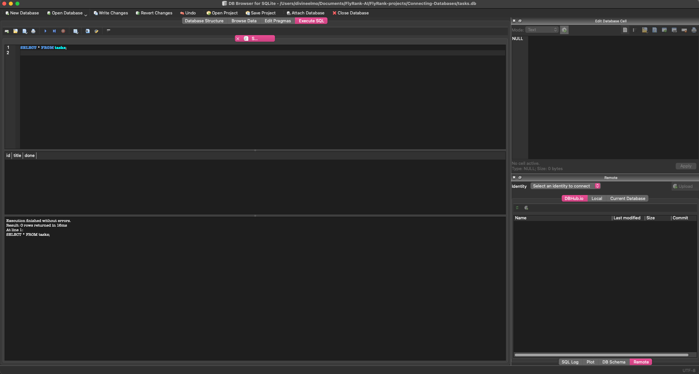

# Connecting CRUD to SQLite Database (Week 3 Assignment A2)

A database-backed Task Management REST API built with **Python**, **FastAPI**, and **SQLite**.

---

## 💡 Why SQLite?
- **Zero Configuration:** No separate database server daemon required—the entire database lives in a single `tasks.db` file.
- **Persistence:** Replaces temporary in-memory array storage with disk persistence so tasks survive server restarts.
- **Built-in Standard:** Native to Python's standard library (`sqlite3`), making it fast, simple, and lightweight.

---

## 📂 Database Storage & Setup
- **File Name:** `tasks.db` (automatically created on server startup).
- **Git Strategy:** Included in `.gitignore` so every new clone automatically generates its own fresh database and seeds initial tasks on first boot[cite: 1].

---

## 🚀 Quick Start Guide

### 1. Create & Activate Virtual Environment
```bash
python3 -m venv .venv
source .venv/bin/activate
```

### 2. Install Dependencies
```bash
pip install fastapi uvicorn
```

### 3. Start the Application
```bash
uvicorn main:app --reload
```
> Upon startup, `tasks.db` will be auto-created and pre-populated with 3 initial tasks if the table is empty[cite: 1].

---

## 🔍 SQL Exploration (Stage 4)

Manual query executed in **DB Browser for SQLite**:

```sql
SELECT COUNT(*) FROM tasks;
```
**Result:** Returned total task count (`3` on initial seed)[cite: 1].

### DB Browser Screenshot


---

## 📡 API Endpoints

| Method | Endpoint | Description | Status Codes |
| :--- | :--- | :--- | :--- |
| **GET** | `/tasks` | Fetch all tasks | `200` |
| **GET** | `/tasks/{id}` | Fetch task by ID | `200`, `404` |
| **POST** | `/tasks` | Create new task | `201`, `422` |
| **PUT** | `/tasks/{id}` | Update existing task | `200`, `404`, `422` |
| **DELETE** | `/tasks/{id}` | Delete task by ID | `204`, `404` |