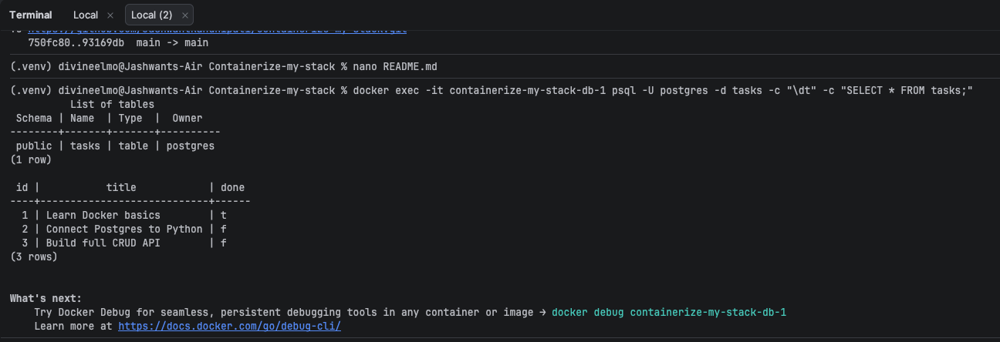

# Containerized Task API

A task management CRUD API built with Python, FastAPI, and PostgreSQL running in Docker containers.

## Quickstart

Run the whole stack with a single command:

```bash
cp .env.example .env
docker compose up --build
```

The API will be live at `http://localhost:8000`.

## Environment Variables

| Variable | Description | Default |
| --- | --- | --- |
| `DATABASE_URL` | PostgreSQL connection string | `postgresql://postgres:dev@db:5432/tasks` |

## API Endpoints

| Method | Endpoint | Description | Status Code |
| --- | --- | --- | --- |
| `GET` | `/tasks` | List all tasks | 200 OK |
| `GET` | `/tasks/{id}` | Get task by ID | 200 OK / 404 Not Found |
| `POST` | `/tasks` | Create a new task | 201 Created / 400 Bad Request |
| `PUT` | `/tasks/{id}` | Update task by ID | 200 OK / 400 / 404 |
| `DELETE` | `/tasks/{id}` | Delete task by ID | 204 No Content / 404 |

## Sample Response

```bash
curl -i http://localhost:8000/tasks
http
HTTP/1.1 200 OK
content-type: application/json

[
  {"id": 1, "title": "Learn Docker basics", "done": true},
  {"id": 2, "title": "Connect Postgres to Python", "done": false},
  {"id": 3, "title": "Build full CRUD API", "done": false}

## Database Verification

Here is the database table schema (`\dt`) and seeded data verified via `psql`:
```

