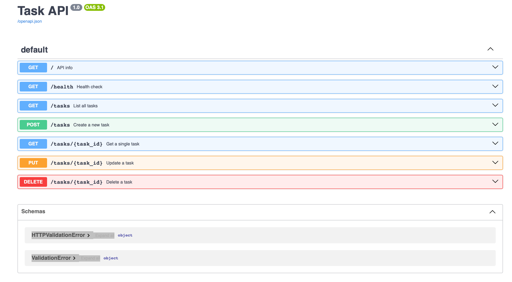

# Task API

A small CRUD API for managing a to-do list, built with FastAPI. Tasks are stored in memory — data resets when the server restarts.

## Run it

```bash
python -m venv .venv
source .venv/bin/activate       # Windows: .venv\Scripts\activate
pip install -r requirements.txt
python -m uvicorn main:app --reload --port 8000
```

Server runs at `http://localhost:8000`. Interactive docs at `http://localhost:8000/docs`.

## Endpoints

| Method | Path            | Description              | Success | Errors   |
|--------|-----------------|---------------------------|---------|----------|
| GET    | `/`             | API info                  | 200     | —        |
| GET    | `/health`       | Health check               | 200     | —        |
| GET    | `/tasks`        | List all tasks             | 200     | —        |
| GET    | `/tasks/{id}`   | Get a single task          | 200     | 404      |
| POST   | `/tasks`        | Create a new task          | 201     | 400      |
| PUT    | `/tasks/{id}`   | Update a task              | 200     | 400, 404 |
| DELETE | `/tasks/{id}`   | Delete a task              | 204     | 404      |

## Example

```
$ curl -i -X POST http://localhost:8000/tasks -H "Content-Type: application/json" -d '{"title":"Test task"}'
HTTP/1.1 201 Created
date: Tue, 21 Jul 2026 20:56:34 GMT
server: uvicorn
content-length: 41
content-type: application/json

{"id":6,"title":"Test task","done":false}
```

## Swagger UI


